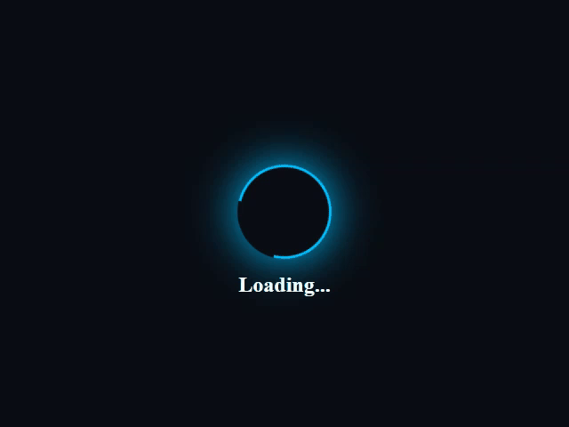

# Loading Effect

這是一個簡單的 HTML 頁面，用於展示一個簡單的「Loading...」效果。該效果包括一個旋轉的圓圈，以及一個顯示「Loading...」文字的元素。這個頁面適用於展示在網站加載時的等待效果。

## 範例演示



## 使用方式

1. 下載或複製 `index.html` 檔案到你的專案資料夾中。

2. 將 CSS 樣式文件 `style.css` 放置在專案的 `../css/` 資料夾中，確保連結正確。

3. 開啟 `index.html`，你將會看到一個展示 Loading 效果的頁面。

## 樣式說明

- `body` 元素設置了頁面的背景色，創建了一個深色背景。
    ```css
    body {
        margin: 0;
        padding: 0;
        background-color: #0A0E14;
    }
    ```

- `.loading` 類別設置了一個具有 flex 屬性的容器，將內容垂直和水平置中，並佔滿整個視窗高度。
    ```css
    .loading {
        display: flex;
        flex-direction: column;
        justify-content: center;
        align-items: center;
        height: 100vh;
    }
    ```

- `.loading__circle` 類別定義了一個圓圈，具有旋轉的動畫效果，並且帶有藍色的邊框和陰影。
    ```html
    <div class="loading__circle"></div>
    ```

    ```css
    .loading__circle {
        width: 100px;
        height: 100px;
        border-radius: 50%;
        border: 3px solid #00BFFF;
        border-top-color: transparent;
        animation: rotate 1s linear infinite;
        box-shadow: 0px 0px 50px #00BFFF;
    }
    ```

- `.loading__text` 類別定義了「Loading...」文字的樣式，包括白色的顏色和粗體字。
    ```html
    <div class="loading__text">Loading...</div>
    ```
    ```css
    .loading__text {
        color: #ffffff;
        font-size: 24px;
        font-weight: bold;
        margin-top: 16px;
    }
    ```
## 適用場景

這個頁面適用於以下情況：

- 網站需要在加載時展示一個簡單的等待效果。

- 你想為網站添加一個簡單的等待頁面，使用戶知道資料正在加載中。

## 注意事項

- 如果你想進一步自定義這個效果，你可以修改 `style.css` 文件中的樣式屬性。

- 請確保將 `style.css` 放置在正確的路徑，以便連結正確的樣式。

## 授權訊息

這個程式遵循 [MIT 授權](LICENSE.txt)，你可以自由地使用、修改和分享這個程式。
